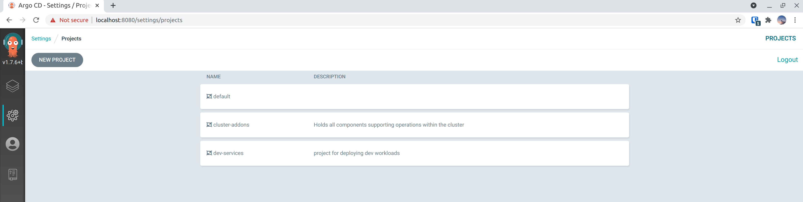
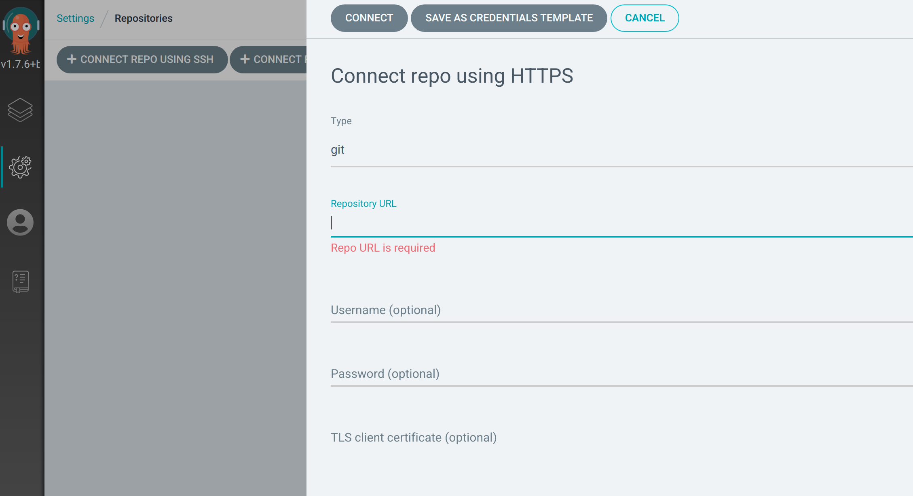
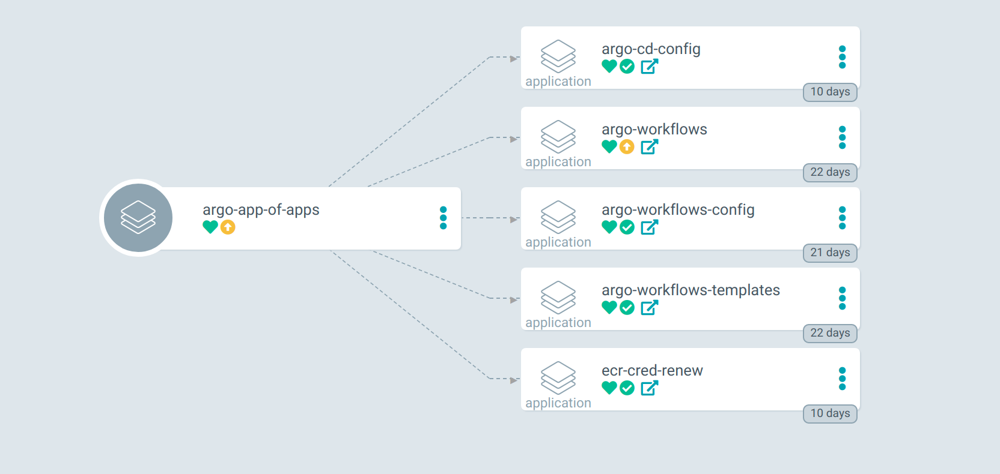
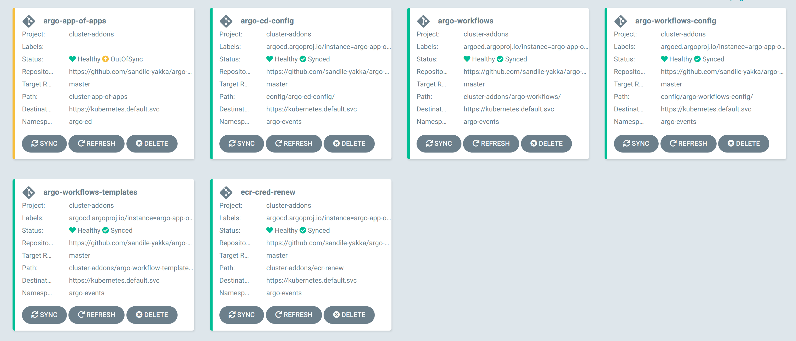
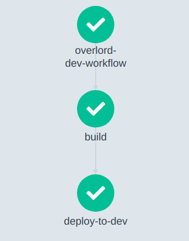
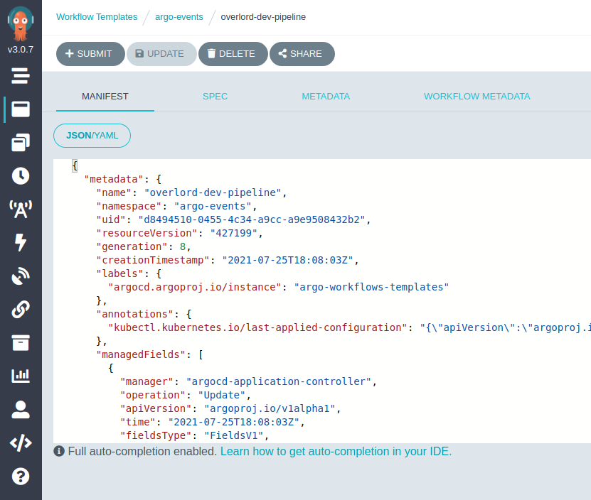

# **Exploring build and deploy with Argo-Workflows and Argo-CD**

## **Introduction** 

In this repository I explore the use of the Argo Project toolset, in particular, I'm looking into **Argo-Workflows** and **Argo-CD**.

The idea is to build a CI/CD workflow using both of the above-mentioned tools to build, push our artifacts to AWS ECR and the have them automatically deployed into a kubernetes cluster. 

#### **Argo-Workflows**

The Argo team describe Argo Workflows as:
> Argo Workflows is an open source container-native workflow engine for orchestrating parallel jobs on Kubernetes.

Argo Workflow is a quite powerful workflow engine and can be used for a myriad of workflows. Here we are going to use use argo-workflows to create a basic CI pipeline powered by [Kaniko](https://github.com/GoogleContainerTools/kaniko) as our container image builder.

#### **Argo-CD**
Likewise in the words of the Argo team:
> Argo CD is a declarative, GitOps continuous delivery tool for Kubernetes.
 
 Well, it's pretty much what has been described above, Argo-CD does an amazing job of deploying resources into your kubernetes cluster and ensuring that these are running at all times.

## Argo-CD setup
<hr/>
Before installing ArgoCD run the init-ns.sh script to setup all the necessary namespaces.

``chmod +x ./scripts/init-ns.sh  && ./scripts/init-ns.sh``

Now that we've created the required namespaces, let's setup ArgoCD.

``chmod +x ./scripts/argo-cd-install.sh && ./scripts/argo-cd-install.sh``

Make sure that your ArgoCD setup is working, you'll find testing instructions in your terminal upon installation. Let's now setup the two ArgoCD Projects to separate deployments for cluster addons and normal service workloards. We'll call these *cluster-addons* and *dev-services*. 

  ``chmod +x ./scripts/init-argocd-project-sh &&  ./scritps/init-argocd-project.sh``

This script will create the two projects we require, later these two projects will be managed by ArgoCD, so as to ensure that no one can mistakenly delete our applications. 
If the above command is successful go to your argo server UI and under the projects tab you should see something like the image below.



The next thing that needs to be done is to create repo connections, ideally, you would be pointing ArgoCD to the repo that contains of the cluster-addon manifests that it need to managed, something like your own fork of this repo.

You can connect ArgoCD to a repo by navigating to navigate to *Settings/Repositories* in your ArgoCD Server UI.



<hr/>

So far so good! Let us now run the [app-of-apps](https://argoproj.github.io/argo-cd/operator-manual/cluster-bootstrapping/) init script:

```
chmod +x ./init-argo-app-of-apps.sh
```

This script is going to apply two ArgoProj Custom Resource Definitions (CRDs) of kind Application. These are:

1. **argo-app-of-apps** - Responsible for deploying and/or reconciling our cluster addons:
  - **ArgoCD** - *You already know this*
  - **ECR Cred Renew** - A simple cron utility for fetching authirazation token from AWS ECR.
  - **Argo-Worfklows** - As described above we are going to use Argo-Workflows to build our Argo CI/CD.
  - **config** - additional resources and configuration for our cluster addons such RBAC, and Argo Projects CRDs.
2. **services-app-of-apps-dev** - Responsible for deploying and/or reconciling our resources that are going to be deployed into the dev namespace.

So let's give ArgoCD a few minutes to deploy the resources defined in *cluster-app-of-apps* and *dev-app-of-apps* , which in turn, are responsible for deploying and/or reconciling resources in the *cluster-addons* and *dev* directories, respectively. Upon completetion your ArgoCD Dashboard should look like the below.

Cluster-Addons             |  App-of-apps Overview  | Example App-of-apps
:-------------------------:|:-------------------------:|:-------------------------:
 |  | 
<hr/>

## **Argo-Workflows Setup** 

At this point of the tutorial Argo Workflows would have been already be installed. Just give you some insight into how that actually happen if you weren't paying attention to what you were doing :p

We have the ```cluster-app-of-apps/templates/argo-workflows.yaml``` Argo Application which deploys the Argo-Workflows helm chart located at ```./cluster-addons/argo-workflo-templates``` and then because we need to grant the Argo-Workflows controller RBAC permissions to be able to create pods upon which it will be able to execute the required workflows.

#### Workflows

As mentioned, our goal is to build a simple kubernetes-native CI/CD pipeline which deploys to a DEV environment while leveraging the power of Argo Workflows & Argo CD. Here's a pictorial representation of the goal.

<div style="text-align:center"></div>

In order to setup the pipeline we need to create two Custom Resource Definitions, the [*WorkflowTemplate*](https://argoproj.github.io/argo-workflows/workflow-templates/#:~:text=Referencing%20Other%20WorkflowTemplates.-,WorkflowTemplate%20Spec,%C2%B6,-v2.7%20and%20after) and [*Workflow*](https://argoproj.github.io/argo-workflows/workflow-templates/#:~:text=%EE%8F%89-,Workflow%20Templates,%C2%B6,-v2.4%20and%20after). 

The build steps are defined are defined in a WorkflowTemplate for reusability. The sample template below can be used to realize the CI graph depicted above.

```
apiVersion: argoproj.io/v1alpha1
kind: WorkflowTemplate
name: overlord-dev-pipeline
...
spec:
  templates:
  - name: build-dag
    dag:
      tasks:
      - name: build
        template: kaniko-build
      - name: deploy-to-dev
        template: deploy-to-dev
        dependencies:
          - build
  - name: kaniko-build
    ...
    container:
      image: gcr.io/kaniko-project/executor:latest
      args: ["--dockerfile={{inputs.parameters.dockerfile_path}}",
             "--context=git://{{inputs.parameters.repo_url}}",
             "--destination={{inputs.parameters.registry_url}}:{{inputs.parameters.branch}}",
             "--git=branch={{inputs.parameters.branch}}"
             ]
    ...
  - name: deploy-to-dev
    inputs:
      parameters:
      ...
    script: 
      command: ['sh']
      source: |
        ... deploy-to-dev      
      image: alpine/git:v2.30.2
      ...
```

In the Workflow template above we use the DAG (Directed Acyclic Graph) to specify a sequence in the CI steps. 
You can see that the *build* step (realized by the template kaniko-build) precedes the *deploy-to-dev* step (realized by deploy-to-dev). The order of execution is guaranteed in this case.


The next resource that has already been created by ArgoCD is the Workflow CRD, which points to the WorkflowTemplate *overlord-dev-pipeline* and has an entry point of the DAG step.

```
apiVersion: argoproj.io/v1alpha1
kind: Workflow
metadata:
  name: overlord-dev-workflow
  generateName: overlord-dev-pipeline
  namespace: argo-events
spec:
  entrypoint: build-dag
  workflowTemplateRef:
    clusterScope: false
    name: overlord-dev-pipeline
```
 
Once a template has been applied, and created by the argo workflows controller it will then show up in the argo workflows ui. A workflow execution can then be executed, resulting in the graph above. 

<div style="text-align:center"></div>

### Future Work

In the future I intend on adding Argo-Events which listens for webhook calls and triggers our CI/CD workflows automatically
#### References
- https://argoproj.github.io/argo-workflows/
- https://argoproj.github.io/argo-cd/
- https://www.youtube.com/watch?v=QyPiJjdtIlw
- https://github.com/nabsul/k8s-ecr-login-renew